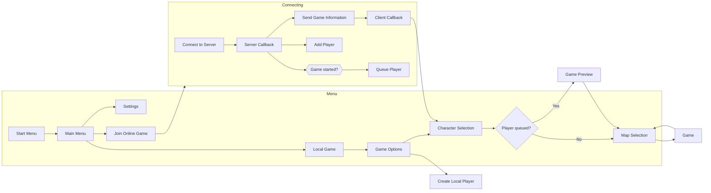

```mermaid
graph LR;
	subgraph menu[Menu];
		direction LR;
		start[Start Menu];
		main[Main Menu];
		settings[Settings];
		local[Local Game];
		options[Game Options];
		online[Join Online Game];
		character[Character Selection];
		player_queued@{ shape: diamond, label: "Player queued?"};
		map[Map Selection];
	end;
	subgraph connecting[Connecting];
		direction LR;
		connect_to_server[Connect to Server];
		server_callback[Server Callback];
		send_game_information[Send Game Information];
		client_callback[Client Callback];
		add_player[Add Player];
		game_started@{ shape: hex, label: "Game started?"};
		queue[Queue Player];
		connect_to_server-->server_callback;
		server_callback-->send_game_information;
		server_callback-->add_player;
	end;
	create_local_player[Create Local Player];
	game[Game];
	game_preview[Game Preview];
	start-->main;
	main-->settings;
	main-->local;
	main-->online;
	local-->options;
	options-->create_local_player;
	options-->character;
	online-->connecting;
	server_callback-->game_started;
	game_started-->queue;
	send_game_information-->client_callback;
	client_callback-->character;
	character-->player_queued;
	player_queued-- No -->map;
	player_queued-- Yes -->game_preview;
	map-->game;
	game_preview-->map;
	game-->map;
```
